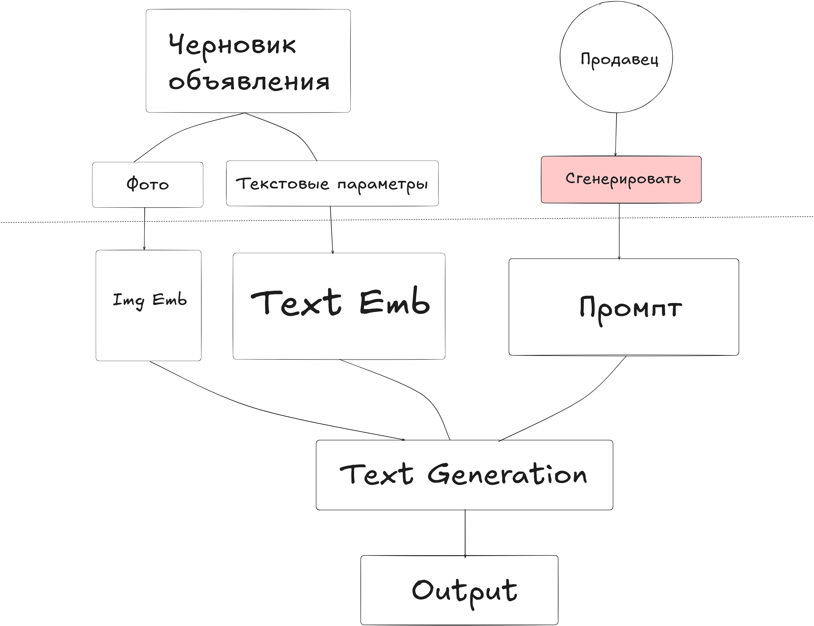

## Схема решения и метрики

### 1) Решение с примером использования.

В качестве решения проблемы необходимо разработать сервис генерации описания к объявлению по параметрам и фото. 
Пользователь загружает фотографии и пишет заголовок и параметры, для них создаются эмбеддинги и передаются в генеративную модель. На выходе из модели получается описание объявления. 

### 2) Бизнес-метрики
Решение должно облегчить продавцам процесс подачи объявления и сделать объявления более привлекательными для покупателей.
Таким образом, основная метрика - увеличение среднего числа контактов на объявлениях с генерацией описания. Также благодаря облегчению процесса подачи может вырасти количество объявлений. 
Рост этих метрик должен быть особенно заметен в Доставке, так как там большее значение играет роль описания.
Увеличение метрики контактов хотя бы на 1.5% можно будет считать успехом.

Контр-метрики: 
- рост числа мошеннических сгенерированных объявлений
- рост числа не прошедших модерацию объявлений (если модерация блокирует похожие на генерацию объявления)

Также в качестве бизнес-метрики можно использовать опрос продавцов после использования генерации (насколько им понравилось).

### 3) ML-метрики
Метрики, оценивающие качество создания описания для фотографий, а также качество генерации:
- BLEU
- CIDE
- METEOR
- ROUGE

Комбинация этих метрик в общем смысле оценивает качество генерации описаний.
